# DDC/CI Screen Tuning

Windows tray application for adjusting monitor brightness, contrast and
night-light settings.

## Features

- Manual controls from the tray icon.
- Automatic adjustment according to the time of day.
- Automatic adjustment from the wireless ambient-light sensor.
- Configurable light curves for each monitor.
- Windows light/dark theme support.

## Screenshots

### Main controls

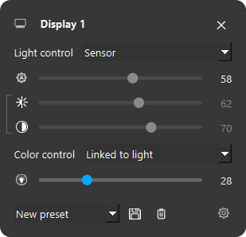

### Brightness and contrast

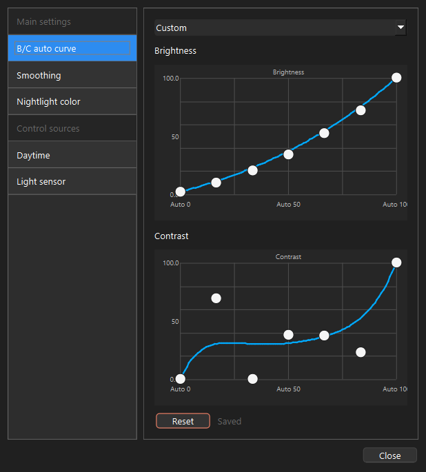

### Automatic control

| Daytime | Ambient-light sensor |
| --- | --- |
| 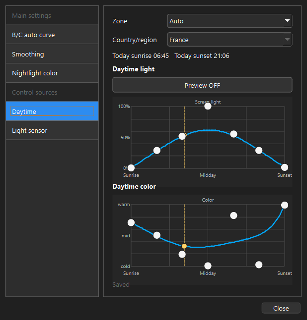 | 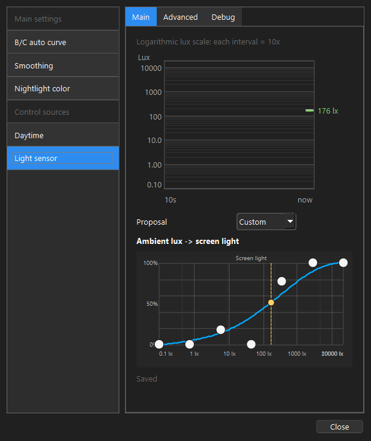 |

### Night-light

| RGB | Gamma ramp |
| --- | --- |
| 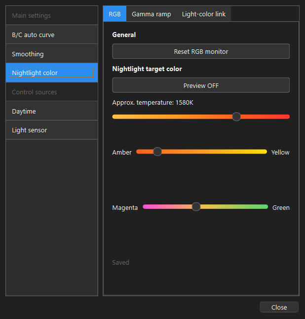 | 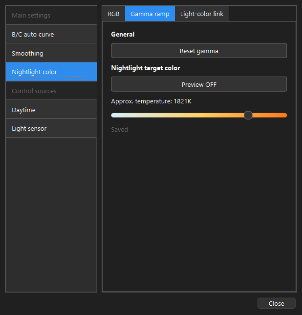 |

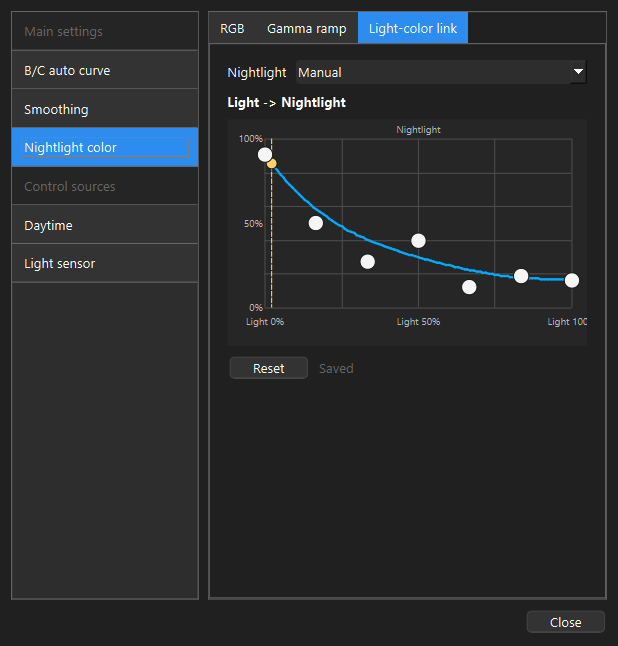

### Other settings

| Smoothing | General settings |
| --- | --- |
| 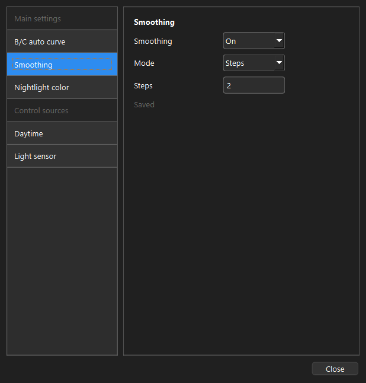 | 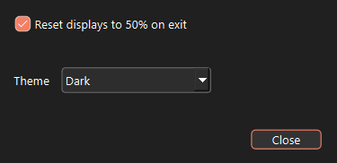 |

| Sensor runtime | Sensor diagnostics |
| --- | --- |
| 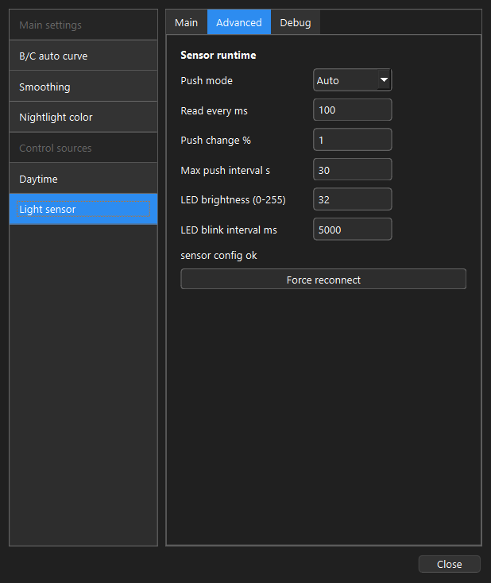 | 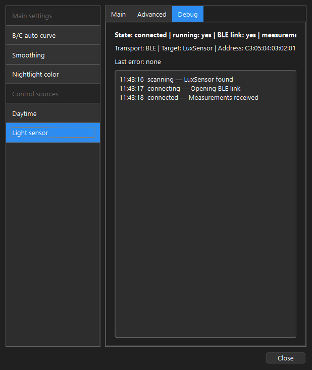 |

## Ambient-light sensor

Power on the `LuxSensor`, enable Bluetooth in Windows and select the ambient
source in the application. The connection and reconnection are automatic.

The sensor can also be connected by USB for charging or diagnostics. The
application automatically switches between USB and Bluetooth.

Sensor firmware:
[ddcci-screen-tuning-tsl2591](https://github.com/nicklausFR/ddcci-screen-tuning-tsl2591)

## Requirements

- Windows 10 or 11.
- A DDC/CI-compatible monitor.
- Bluetooth when using the wireless sensor.

## License

Copyright (C) 2026 nicklausFR.

GPL-3.0-or-later.
